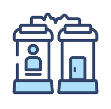

# Secure-File-Teleporter
A simple encrypted file transfer peer to peer system.

 

  
  <h3 align="center">Secure File Teleporter</h3>

A simple encrypted, peer-to-peer file transfer system.

### Features to be implemented
   - Peer-to-Peer connection.
   - RSA key encryption.
   - Bi-directional file transfer.
